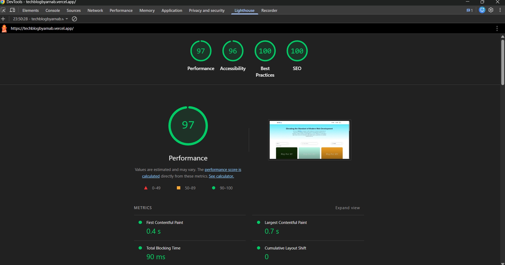
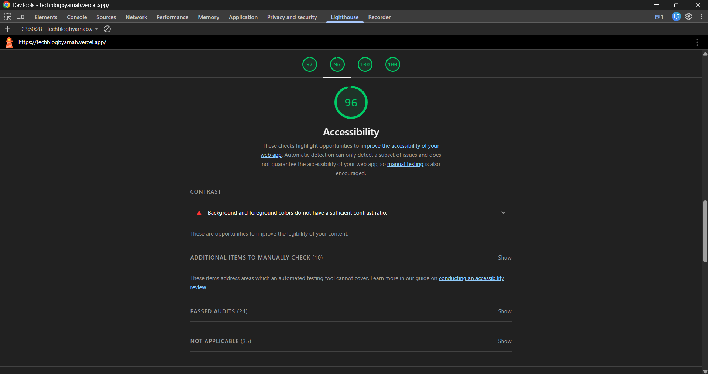
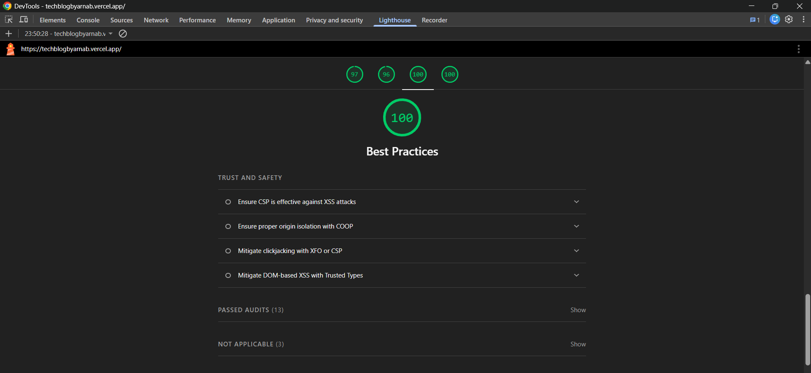
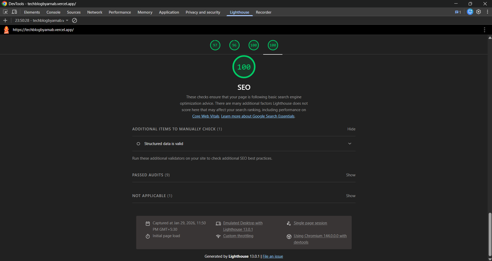

# 🧠 TechBlog – Modern Tech Insights Platform

TechBlog is a **modern, SEO-optimized blogging platform** built with **Next.js App Router** and **Redux Toolkit**, focusing on **performance, accessibility, and clean UI/UX**.

The platform supports **article search**, **category filtering**, **dark/light theme persistence**, and follows **structured SEO best practices**, making it production-ready and Lighthouse-optimized.

---

## 🚀 Live Features

- 🔍 **Article Search** (title, description, content)
- 🗂 **Category Filtering**
- 🌙 **Dark / Light Theme** with `localStorage` persistence
- ⚡ **Fast Loading** using Next.js App Router
- ♿ **Accessible UI**
- 📱 **Fully Responsive Design**
- 🔎 **SEO-Friendly Architecture**

---

## 💻 Live Demo

- **👉 Live URL:** [Live link here](https://techblogbyarnab.vercel.app/)

## 📂 GitHub Repository

- **👉 Repo URL:** [GitHub link here](https://github.com/Mitrarnab/Tech-Blog)

---

## 📊 Lighthouse Audit Results

Lighthouse audits were conducted using **Chrome DevTools** in **production mode**.

### Performance

### Accessibility

### Best Practices

### SEO

## Target Scores Achieved

- **Performance:** 90+

- **Accessibility:** 85+

- **Best Practices:** 90+

- **SEO:** 95+

---

## 🔍 SEO Strategy

SEO was a core focus of this project. The application follows modern SEO best practices using **Next.js App Router**, ensuring content is crawlable, fast, and accessible.

---

### 🏷 Meta Tags Implementation (What & Why)

Meta tags were implemented using the **Next.js Metadata API**, enabling server-rendered SEO metadata without manual `<head>` management.

#### Implemented Meta Tags

- **Title**
  - Defines the page title shown in browser tabs and search results
  - Improves click-through rate (CTR)

- **Description**
  - Provides a concise summary for search engines
  - Used as the search snippet in SERPs

- **Viewport**
  - Ensures proper rendering on all devices
  - Improves mobile usability and SEO

- **Open Graph Tags**
  - Enables rich previews when links are shared on social platforms
  - Includes `og:title`, `og:description`, and `og:image`

- **Twitter Card Tags**
  - Optimized previews for Twitter/X sharing
  - Uses large image cards for better engagement

- **JSON-LD Structured Data**
  - WebSite schema implemented for better search engine understanding
  - Improves indexing and discoverability

---

### 🧱 Semantic HTML Structure

The application uses **semantic HTML elements** to improve accessibility and SEO.

#### Structure Overview

- `<header>` → Navigation and site branding
- `<main>` → Primary page content
- `<section>` → Logical grouping of related content
- `<article>` → Individual blog posts
- `<footer>` → Copyright and metadata

#### Benefits

- Helps search engines understand content hierarchy
- Improves screen reader accessibility
- Enhances overall SEO ranking signals
- Aligns with modern web standards

---

### 🖼 Image Optimization Approach

Images are optimized using the **Next.js `<Image />` component**.

#### Optimization Techniques

- Automatic lazy loading
- Responsive image sizing per device
- Optimized formats (WebP)
- Prevents layout shifts by reserving image space

#### Impact

- Reduces Largest Contentful Paint (LCP)
- Improves Core Web Vitals
- Enhances page load performance

---

### ⚡ Performance Optimizations

Performance was optimized to directly support SEO and user experience.

#### Key Optimizations

- Server-side rendering using **Next.js App Router**
- Client components used only where required
- Memoization using:
  - `useMemo` for search and filtering
  - `useCallback` for event handlers
- Minimal re-renders using Redux selectors
- Avoided unnecessary DOM manipulations
- Eliminated blocking scripts

#### Result

- Faster page load times
- Higher Lighthouse scores
- Improved search engine crawlability

---

### ✅ Summary

This SEO strategy ensures:

- Crawlable, server-rendered content
- Strong Core Web Vitals performance
- Accessible, semantic markup
- Optimized social sharing previews

The application is built to meet modern SEO and performance standards.

---

## 🔎 Search & Filter Implementation Approach

The search and category filtering functionality was designed to be **fast, scalable, and user-friendly**, while avoiding unnecessary re-renders.

---

### 🔍 Search Implementation

The search feature allows users to search blog articles across multiple fields:

- Title
- Description
- Content text

#### Approach

- Implemented as a **controlled input**
- Search is **case-insensitive**
- Filtering logic is memoized using `useMemo`
- Prevents recalculation on every render

---

## ⚠ Challenges Faced

During development, several real-world challenges were encountered and resolved to ensure a production-ready application.

---

### 1️⃣ Theme Persistence with Server-Side Rendering

**Challenge:**  
Dark mode reset on page refresh due to server-side rendering and `localStorage` being client-only.

**Solution:**

- Implemented client-only mounting guards
- Safely read theme preference from `localStorage`
- Avoided direct DOM manipulation (`document.classList`)
- Managed theme state using Redux Toolkit

---

### 2️⃣ SEO Implementation in App Router

**Challenge:**  
Ensuring proper SEO while using client components in Next.js App Router.

**Solution:**

- Used Next.js Metadata API for server-rendered meta tags
- Implemented Open Graph and Twitter Card metadata
- Injected JSON-LD structured data
- Server-rendered all critical content

---

### 3️⃣ Lighthouse Performance Optimization

**Challenge:**  
Achieving high Lighthouse scores across all categories.

**Solution:**

- Optimized images using Next.js Image component
- Eliminated blocking scripts
- Reduced unnecessary client-side JavaScript
- Improved semantic HTML structure

---

## 🛠 Technologies Used

### Frontend

- **Next.js 14 (App Router)**
- **React 18**
- **TypeScript**
- **Redux Toolkit**
- **Tailwind CSS**

### Performance & SEO

- **Next.js Metadata API**
- **JSON-LD (Schema.org)**
- **Lighthouse**
- **Open Graph & Twitter Cards**

### UI & Utilities

- **React Icons**
- **LocalStorage (Theme Persistence)**

---

## ✅ Summary

This project demonstrates the ability to:

- Solve real-world SSR and SEO challenges
- Build scalable and performant frontend architecture
- Apply modern best practices in accessibility, SEO, and UI/UX
